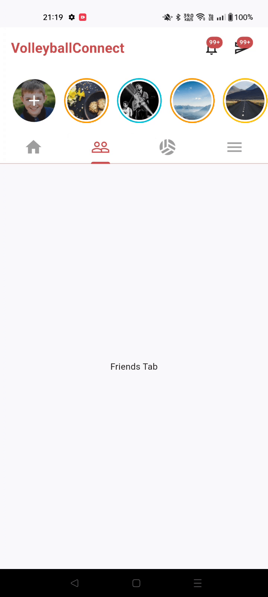

# Volleyball Connect (Demo) 🏐

A portfolio demo showcasing a BLoC refactor of a legacy Flutter and Firebase project.

---

## 🛠 Tech Stack

- **Framework:** Flutter & Dart
- **State:** `flutter_bloc`
- **Backend:** Firebase Core, Auth, Firestore, Storage
- **Navigation:** `go_router`
- **UI Scaling:** `flutter_screenutil`
- **Testing:** `bloc_test`, `mocktail`, `flutter_test`

---

## 📱 App Demo

### Matches & Navigation

  

### Feed & Interactions

  

